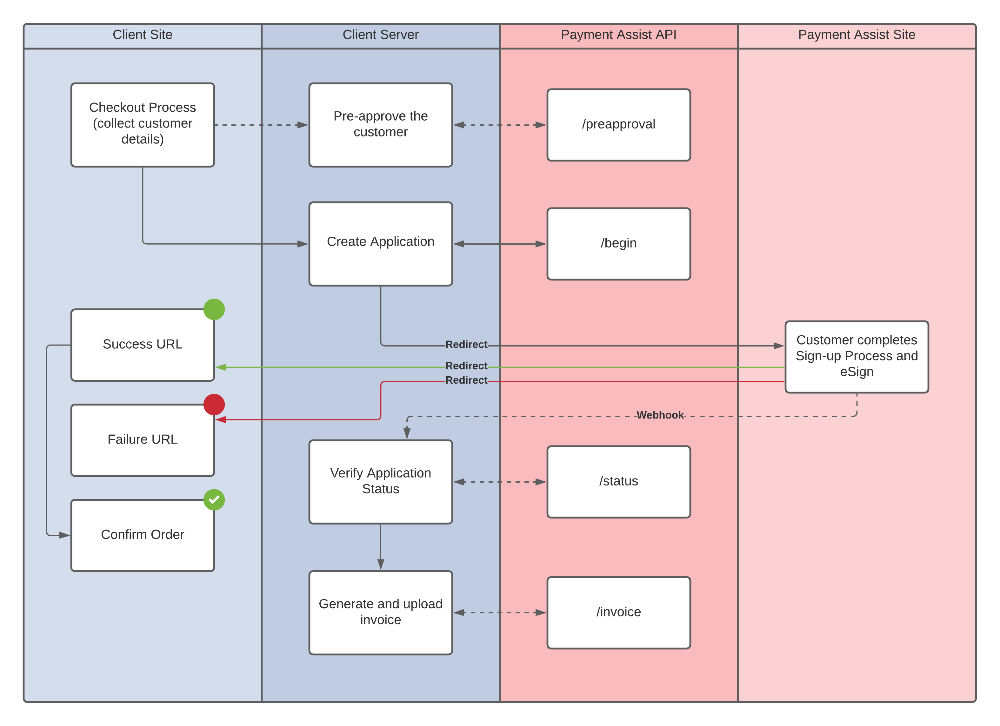

# Overview

The Payment Assist API allows for programmatic integration of our lending service into your own software. This is typically during the checkout phase of your service/product purchase flow.


The Payment Assist API is now GA. To access your credentials: login to the dealer dashboard, click your username/email \(top right\) and click [API Credentials](https://secure.payment-assist.co.uk/settings?tab=api).


Below is a high-level visualisation of the workflow for web integrations \(customer is on session\):

### Workflow explained

The API workflow outlined above can be augmented with a pre-approval process conducted entirely while the customer is on the client site by making a request to the ​ `/preapproval` ​ endpoint \(see​ [API Methods](methods/)\).

| **Stage** | **Description** |
| :--- | :--- |
| 1 | Capture some customer details within the client site UI. At a minimum this must be all required fields for the​ `/begin`​ endpoint \(see ​[API Methods](methods/)\) |
| 2 \(_optional_\) | Obtain pre-approval for the customer by sending a subset of the required fields to the ​ `/preapproval​` endpoint. |
| 3 | Send the customer details to the​ `/begin`​ endpoint to receive a continuation token and redirect URL. |
| 4 | Redirect the customer to the Payment Assist website to complete the payment and eSigning requirements. |
| 5 | Upon the customer returning to the client site, validation can be made in one of two ways: \(1\) by verifying the `signature` GET parameter appended to your success/failure URL, OR, \(2\) by making a new request to the `/status` endpoint passing the token received in stage 3. |
| 6 \(_optional_\) | In order for the funds to be paid out, we also require the original customer invoice to be uploaded. This can be automated via the `/invoice` endpoint, or it can be completed manually via the dealer dashboard. |

## Contributions

If you see an error or feel we can improve our documentation in any way, please fork our [public github repo](https://github.com/paymentassist/gitbook-api-docs), create a new branch with your proposed changes and open a PR.
